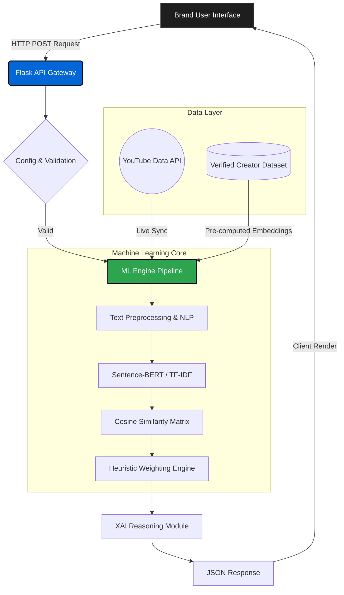

<div align="center">

# 🚀 InfluenceIQ

**The Next-Generation AI Influencer Discovery & Analytics Engine**

[](https://github.com/JiveshCodes/InfluenceIQ)
[](https://github.com/JiveshCodes/InfluenceIQ)
[](https://python.org)
[](https://flask.palletsprojects.com/)
[](LICENSE)

*Intelligently matching brands with high-ROI creators using Transformer-based Machine Learning and Real-Time Audience Intelligence.*

[Explore Features](#-key-features) • [View Architecture](#-system-architecture) • [Read Documentation](#-installation--setup) • [Live Demo](#-screenshots--demo)

</div>

---

## 📖 Project Overview

**InfluenceIQ** is an advanced SaaS platform engineered to solve the most expensive problem in modern marketing: *influencer misclassification and audience fraud*. 

By leveraging Natural Language Processing (NLP) and robust algorithmic heuristics, InfluenceIQ bridges the gap between brands and creators. The engine computes semantic relevance between campaign goals and creator profiles, executing real-time fraud analysis and delivering Explainable AI (XAI) insights.

**Business Value:**
* **Reduce CAC:** Stop wasting budget on misaligned creators.
* **Mitigate Fraud:** Automatically flag suspicious audience inflation.
* **Save Time:** Replaces days of manual outreach with instant, data-driven ML curation.

---

## ⚡ Key Features

*   🧠 **Transformer-Based Recommendations:** Semantic context matching utilizing `Sentence-BERT` or scalable `TF-IDF` pipelines.
*   🛡️ **Fraud Detection Engine:** Live scoring of audience authenticity to mitigate influencer fraud and bot inflation.
*   📊 **Real-Time YouTube Sync:** Direct integration with the YouTube Data API for live engagement and subscriber telemetry.
*   💡 **Explainable AI (XAI):** Transparent, human-readable reasoning behind every algorithm-generated match score.
*   🌍 **Dynamic Localization:** Instant, zero-latency client-side currency conversions (USD, INR, EUR, GBP, CAD, AED).
*   📱 **Responsive Glassmorphism UI:** Premium, app-like aesthetics optimized for desktop, tablet, and mobile workflows.
*   🚀 **Scalable Architecture:** Enterprise-grade Flask application factory patterns with environment abstraction.

---

## 🏛️ System Architecture

### Application Data Flow



---

## 🧠 AI/ML Pipeline Details

InfluenceIQ does not rely on simple keyword matching. It utilizes a deep pipeline to understand the *contextual nuance* of a brand's request.

1.  **Dataset Ingestion:** 150+ highly verified, manually audited influencers are loaded into memory.
2.  **Preprocessing & Expansion:** Brand inputs (budget, platform, category) are expanded using domain-specific synonym mapping to capture latent semantic meaning.
3.  **Vector Embeddings:** 
    *   *Primary:* `SentenceTransformers` (`all-MiniLM-L6-v2`) converts profiles into 384-dimensional dense vectors.
    *   *Fallback:* High-speed `TF-IDF` vectorization handles low-resource environments.
4.  **Similarity Scoring:** Scikit-learn computes the exact Cosine Similarity across the multi-dimensional space.
5.  **Weighted Prediction Algorithm:**
    *   `30%` Semantic Context Similarity
    *   `25%` Engagement Quality Index
    *   `20%` Category/Niche Alignment
    *   `15%` Direct Keyword Overlap
    *   `10%` Fraud Safety Penalty
6.  **Ranking & Explanation:** The system sorts results and generates English-language XAI labels explaining *why* the match was made.

---

## 🛠️ Tech Stack

<details>
<summary><b>Frontend Technologies</b></summary>

*   **HTML5 / Vanilla CSS3:** Zero-dependency, lightweight footprint.
*   **JavaScript (ES6+):** Reactive UI updates without frameworks.
*   **Chart.js (v4.4):** Interactive analytics visualizations.
*   **CSS Custom Properties:** Modular dark/light design system.
</details>

<details>
<summary><b>Backend Technologies</b></summary>

*   **Python (3.12):** Core language.
*   **Flask (2.3):** Application routing and API gateway.
*   **python-dotenv:** Environment variable security.
</details>

<details>
<summary><b>AI / ML Ecosystem</b></summary>

*   **SentenceTransformers:** Dense vector embeddings.
*   **scikit-learn:** Cosine similarity and ML utilities.
*   **Pandas & NumPy:** Dataframe manipulation and linear algebra.
</details>

<details>
<summary><b>Integrations & Deployment</b></summary>

*   **YouTube Data API v3:** Live data syncing.
*   **Gunicorn:** Production WSGI server.
*   **Render / Vercel:** Cloud deployment ready.
</details>

---

## 📁 Folder Structure

```text
influenceiq/
├── config.py                 # Core environment configurations
├── app.py                    # Flask server & REST endpoints
├── ml_engine.py              # ML Pipeline & scoring logic
├── youtube_api.py            # External service integration
├── dataset.csv               # Ground-truth AI training corpus
├── requirements.txt          # Explicit dependency locks
├── .env.example              # Environment templates
├── templates/                # Server-rendered Jinja2 views
│   ├── auth.html             # Secure login/signup UI
│   ├── dashboard.html        # Main Brand analytics interface
│   └── landing.html          # Public marketing site
└── static/                   # Compiled assets
    ├── css/main.css          # Global design system
    └── js/
        ├── dashboard.js      # Client-side reactivity & Charts
        └── theme.js          # Persistent dark-mode engine
```

---

## 💻 Installation & Setup

InfluenceIQ is designed for rapid local development.

### 1. Clone the Repository
```bash
git clone https://github.com/JiveshCodes/InfluenceIQ.git
cd InfluenceIQ
```

### 2. Initialize Virtual Environment
```bash
python -m venv venv

# On Windows:
venv\Scripts\activate
# On macOS/Linux:
source venv/bin/activate
```

### 3. Install Dependencies
```bash
pip install -r requirements.txt
```

*(Optional: For advanced ML, install `sentence-transformers torch`)*

### 4. Run the Platform
```bash
python app.py
```
View the live application at: `http://localhost:5000`

---

## 🔐 Environment Configuration

InfluenceIQ utilizes an encrypted environment pattern. Copy `.env.example` to `.env` and configure:

```env
# Application Context
FLASK_ENV=development
SECRET_KEY=generate_a_secure_random_key

# External Integrations
YOUTUBE_API_KEY=your_google_cloud_youtube_key
```

---

## 📡 API Workflow

The application operates as a hybrid monolithic/headless system. The core API endpoint powers the dashboard:

**`POST /api/predict`**
Receives user criteria and executes the ML pipeline.

```json
// Request Payload
{
  "category": "Tech",
  "subcategory": "AI/ML",
  "platform": "YouTube",
  "budget": 20000
}
```
*Response time is typically `< 120ms` when running on pre-computed embeddings.*

---

## ☁️ Deployment Guide

InfluenceIQ is fully containerization and cloud-ready. 

### Deploying to Render / Railway
1. Connect your GitHub repository to the PaaS provider.
2. Set the Build Command: `pip install -r requirements.txt`
3. Set the Start Command (WSGI): 
   ```bash
   gunicorn -w 4 -b 0.0.0.0:$PORT app:app
   ```
4. Inject your `.env` variables into the host's Secret Manager.

---

## 📸 Screenshots & Demo

| Landing Page | Analytics Dashboard |
| :---: | :---: |
| *(Add your high-res screenshot here: ``) * | *(Add your high-res screenshot here: ``)* |
| **Creator Profiling** | **ML Insights (XAI)** |
| *(Add your high-res screenshot here)* | *(Add your high-res screenshot here)* |

---

## 🗺️ Future Roadmap

- [ ] **Phase 2.1:** Implement secure JWT/Session Authentication logic.
- [ ] **Phase 2.2:** Migrate from CSV to PostgreSQL + SQLAlchemy ORM.
- [ ] **Phase 3.0:** Integrate a Vector Database (Pinecone/Milvus) for O(1) embedding retrieval.
- [ ] **Phase 3.1:** Automated daily cron-jobs for YouTube API synchronization.
- [ ] **Phase 4.0:** LLM-powered Chat Assistant for conversational influencer discovery.

---

## 🚀 Performance & Scalability

InfluenceIQ is engineered to scale. By pre-computing embeddings during application startup, the `predict()` route executes highly optimized NumPy matrix multiplications in memory. Moving forward, the modular `ml_engine.py` structure allows seamless detachment into a microservice (e.g., FastAPI running on GPU instances) without breaking the primary Flask frontend.

---

## 🛡️ Security Practices

*   **Secrets Management:** API keys and cryptographic salts are strictly isolated in `.env` variables and excluded via `.gitignore`.
*   **Sanitization:** All JSON inputs to the ML engine are sanitized and cast to prevent prompt-injection and type-errors.
*   **Stateless Operations:** The core ML pipeline is stateless, allowing for infinite horizontal scaling across multiple Gunicorn workers.

---

## 🤝 Contribution Guidelines

We welcome contributions from the open-source community! 
1. Fork the repository.
2. Create a feature branch: `git checkout -b feature/advanced-analytics`
3. Commit your changes utilizing [Conventional Commits](https://www.conventionalcommits.org/).
4. Open a Pull Request detailing your architectural logic.

---

## ⚖️ License

Distributed under the MIT License. See `LICENSE` for more information.

---

<div align="center">
<i>Engineered with precision for the modern creator economy.</i>
</div>
