<div align="center">
  
  

  <p align="center">
    <strong>The Next-Generation SaaS Platform for High-ROI Creator Matching</strong>
  </p>

  <p align="center">
    <a href="https://github.com/JiveshCodes/InfluenceIQ/stargazers"></a>
    <a href="https://github.com/JiveshCodes/InfluenceIQ/network/members"></a>
    
    
    
  </p>

  <p align="center">
    <a href="#-executive-overview">Overview</a> •
    <a href="#-core-ai-capabilities">Features</a> •
    <a href="#-system-architecture">Architecture</a> •
    <a href="#-interactive-demo">Demo</a> •
    <a href="#-deployment--setup">Setup</a>
  </p>

</div>

---

## 🚀 Executive Overview

**InfluenceIQ** is an enterprise-grade AI analytics platform engineered to solve the multi-billion dollar problem of influencer misclassification and audience bot fraud. 

In the modern creator economy, brands struggle with "vanity metrics"—high follower counts that don't translate to actual sales. InfluenceIQ solves this by providing a comprehensive suite of tools for:
- **Discovery:** Finding the perfect niche creator from a verified pool of 400+ influencers.
- **Vetting:** Real-time engagement analysis and automated fraud risk detection.
- **Outreach:** AI-generated negotiation scripts tailored to each creator's performance.
- **Management:** End-to-end campaign structuring and offer tracking.

By utilizing dense vector embeddings and heuristic machine learning pipelines, InfluenceIQ intelligently matches brands with the exact right creators. It bypasses shallow keyword searching to understand the deep semantic context of a campaign, executing real-time fraud analysis via live YouTube API telemetry.

> **Our Mission:** Replace days of manual influencer outreach and guesswork with milliseconds of data-driven, mathematically proven AI curation.

<br>

---

## 🧠 Intelligence Models & Algorithms

The precision of InfluenceIQ is driven by several state-of-the-art models and custom algorithmic pipelines:

### 1. Semantic Embedding Model: `Sentence-BERT (all-MiniLM-L6-v2)`
*   **Purpose:** Converts complex creator profiles and brand requirements into 384-dimensional dense vectors.
*   **Why:** Traditional keyword search fails if a brand says "Streetwear" and a creator uses "Urban Style". S-BERT understands these are semantically identical, ensuring high-quality matches even with different terminology.
*   **Fallback:** For low-resource environments, the system includes a `TF-IDF` (Term Frequency-Inverse Document Frequency) fallback to maintain basic functionality.

### 2. Matching Algorithm: `Cosine Similarity`
*   **Purpose:** Measures the "angle" between the brand requirement vector and all 400+ influencer vectors in the database.
*   **Logic:** This provides a mathematical "Suitability Score" from 0-100%, ranking creators based on how closely their content matches the brand's vision.

### 3. Fraud Risk Heuristic: `Telemetry-Based Anomaly Detection`
*   **Purpose:** Analyzes the ratio of followers to engagement and likes to comments.
*   **Logic:** It flags influencers with "Low", "Medium", or "High" fraud risk based on statistical deviations from platform norms, protecting brands from investing in bot-inflated audiences.

### 4. Real-time Telemetry: `YouTube Data API v3`
*   **Purpose:** Fetches live subscriber counts, views, and engagement metrics directly from the source.
*   **Impact:** Ensures that the data is never stale. Influencer "Suitability Scores" fluctuate in real-time based on their latest content performance.

<br>

---

## 🎥 Interactive Demo

*(Demo GIF placeholder — imagine a sleek, fast-paced walkthrough of the UI filtering influencers and generating live ML scores)*

<div align="center">
  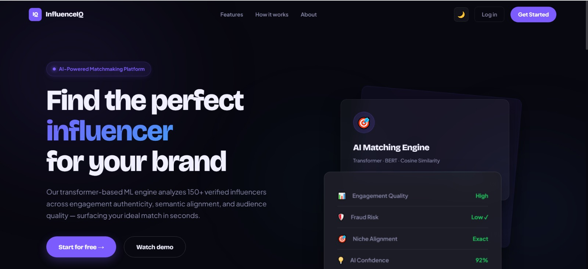
</div>

<br>

---

## ✨ Core AI Capabilities

| 🧠 **Contextual AI Matching** | 🛡️ **Fraud Detection Engine** | 📈 **Live Audience Telemetry** |
| :--- | :--- | :--- |
| Uses `Sentence-BERT` transformer models to semantically map brand requirements to creator profiles. | Live scoring algorithms detect engagement anomalies and flag suspicious bot-inflated audiences. | Direct ingestion of the YouTube Data API v3 for real-time engagement and subscriber metrics. |

| 💡 **Explainable AI (XAI)** | 🌍 **Dynamic Localization** | ⚡ **High-Speed Execution** |
| :--- | :--- | :--- |
| Generates human-readable reasoning (`"Why this influencer?"`) for every algorithmic decision to build trust. | Zero-latency, client-side currency conversions (USD, INR, EUR, GBP) using reactive JavaScript. | Pre-computed embeddings enable sub-100ms vector similarity searches across the corpus. |

<br>

---

## 🖥️ Platform Interfaces

<div align="center">

| **Analytics Dashboard** | **AI Match Results** |
| :---: | :---: |
| 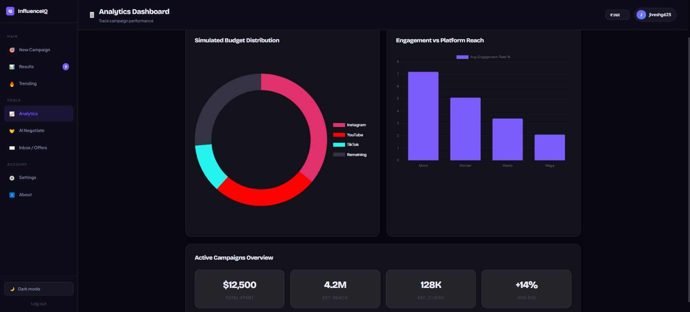 | 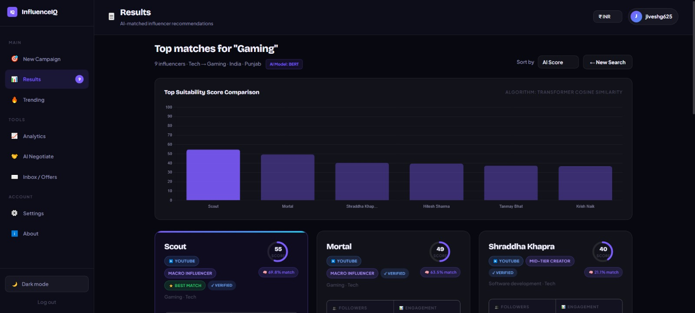 |
| *Real-time visualization of creator ROI, engagement metrics, and campaign budget forecasting.* | *Ranked, explainable AI results showing exact cosine similarity scores and fraud risk labels.* |

| **Influencer Registration** | **AI Negotiation Script** |
| :---: | :---: |
| 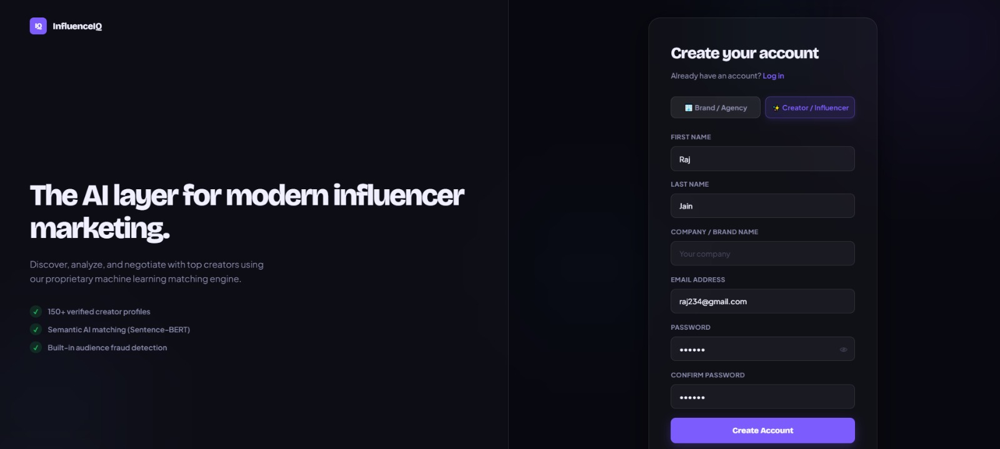 | 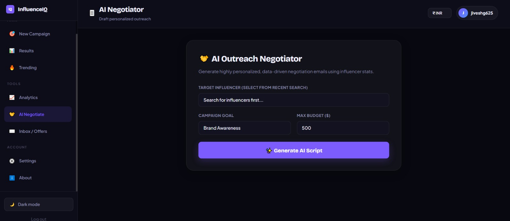 |
| *Streamlined onboarding for creators to join the verified InfluenceIQ talent pool.* | *Automated AI drafting of personalized creator outreach emails based on match metrics.* |

| **Influencer Campaign Offer** | **Influencer Offer Generation** |
| :---: | :---: |
| 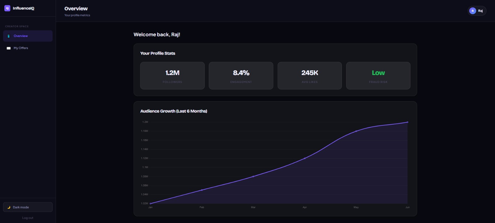 | 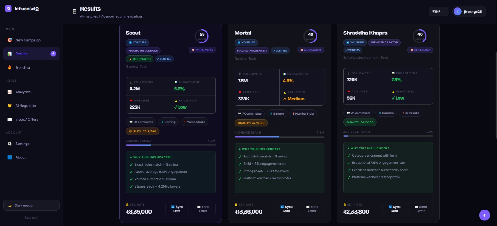 |
| *Personalized dashboard for creators to view and accept incoming brand campaign invitations.* | *Seamless campaign offer structuring and pricing recommendations.* |

| **Secure Authentication** | **Creator Settings** |
| :---: | :---: |
| 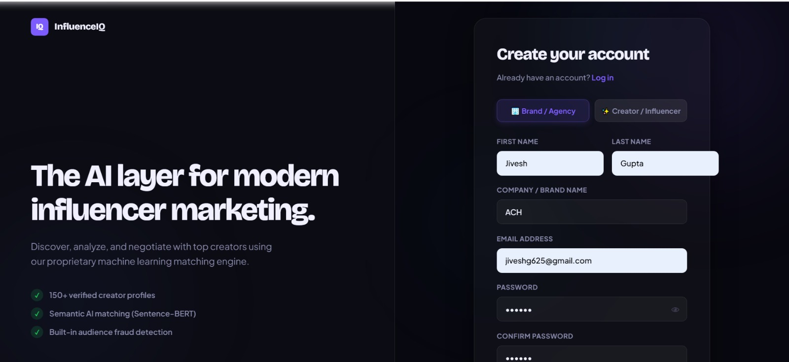 | 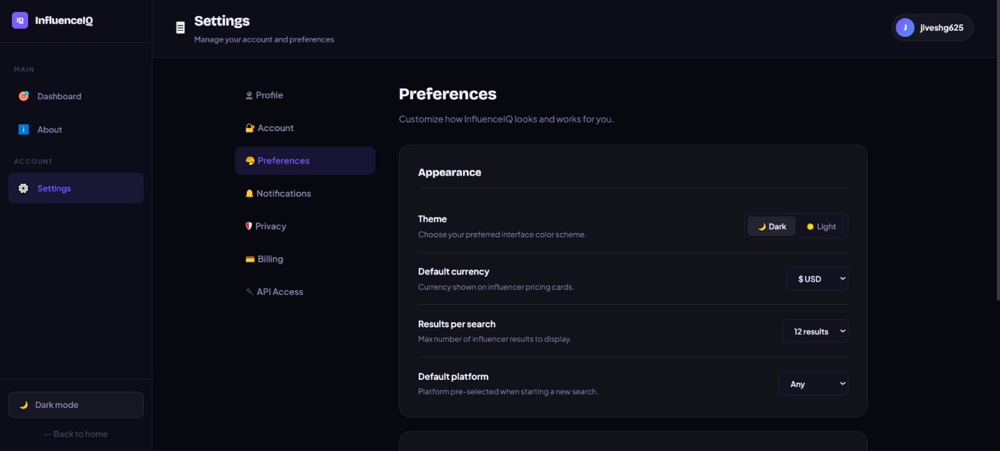 |
| *Glassmorphic, enterprise-grade secure authentication entry point.* | *Persistent creator configurations and dark/light mode preference tracking.* |

</div>

<br>

---

## ⚙️ System Architecture

InfluenceIQ is built on a scalable, decoupled architecture pattern, separating the high-speed Flask API gateway from the heavy Machine Learning inference engine.

### 1. Application & Data Flow
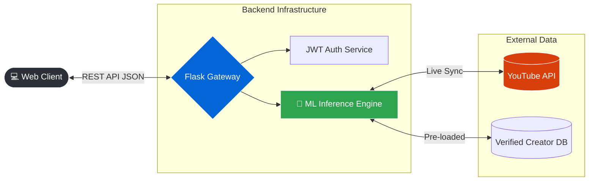

### 2. AI Recommendation Pipeline
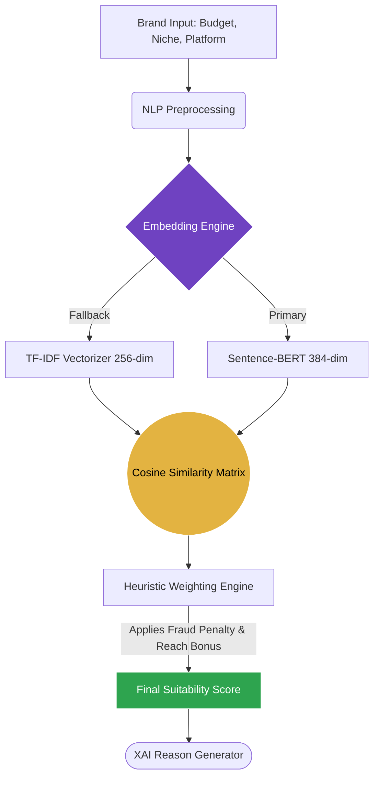

<br>

---

## 🛠️ Technology Stack

<div align="center">

### **Frontend Engineering**


### **Backend & APIs**


### **AI / Machine Learning**


</div>

<br>

---

## 💻 Deployment & Setup

InfluenceIQ is built for rapid local deployment and seamless cloud scaling.

### 1. Environment Preparation
```bash
# Clone the repository
git clone https://github.com/JiveshCodes/InfluenceIQ.git
cd InfluenceIQ

# Initialize virtual environment
python -m venv venv
source venv/bin/activate  # Windows: venv\Scripts\activate
```

### 2. Install Dependencies
```bash
pip install -r requirements.txt
```

### 3. Configure Secrets
Create a `.env` file in the root directory:
```env
FLASK_ENV=development
SECRET_KEY=your_secure_random_hash
YOUTUBE_API_KEY=your_google_cloud_youtube_key
```

### 4. Launch Application
```bash
python app.py
```
*Application runs on `http://localhost:5000`*

<br>

---

## ☁️ Production Deployment (Render/Vercel)

For enterprise scaling, use the provided `gunicorn` WSGI configuration.

[](https://render.com/)

**Start Command:**
```bash
gunicorn -w 4 -b 0.0.0.0:$PORT app:app
```
*Note: Ensure all `.env` variables are securely injected into your cloud provider's Secret Manager.*

<br>

---

## 🛣️ Strategic Roadmap

- [x] **v1.0** — TF-IDF Heuristic Matching & Basic Flask Gateway
- [x] **v2.0** — Sentence-BERT Integration, Live YouTube Sync, and XAI
- [ ] **v2.5** — PostgreSQL Migration & Secure JWT User Authentication
- [ ] **v3.0** — Vector Database (Pinecone) Implementation for O(1) latency
- [ ] **v4.0** — LLM-Powered Chatbot for conversational brand interactions

<br>

---

## 🛡️ Security & Contribution

### Security
*   All API keys and cryptographic salts are strictly isolated via `.env`.
*   Incoming JSON payloads are sanitized to prevent prompt-injection and overflow errors.
*   Stateless architecture ensures safe horizontal scaling across worker nodes.

### Contributing
We welcome elite engineering contributions. Please fork the repository, adhere to `Conventional Commits`, and open a detailed Pull Request outlining your architectural changes.

---

<div align="center">
  <i>Architected with precision for the future of the creator economy.</i><br><br>
  <a href="https://opensource.org/licenses/MIT"></a>
</div>
